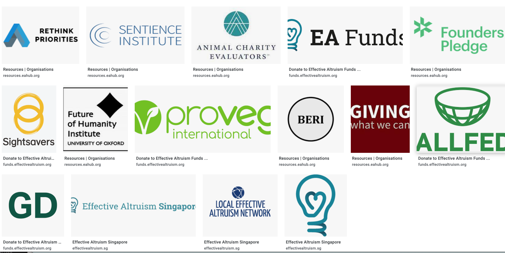
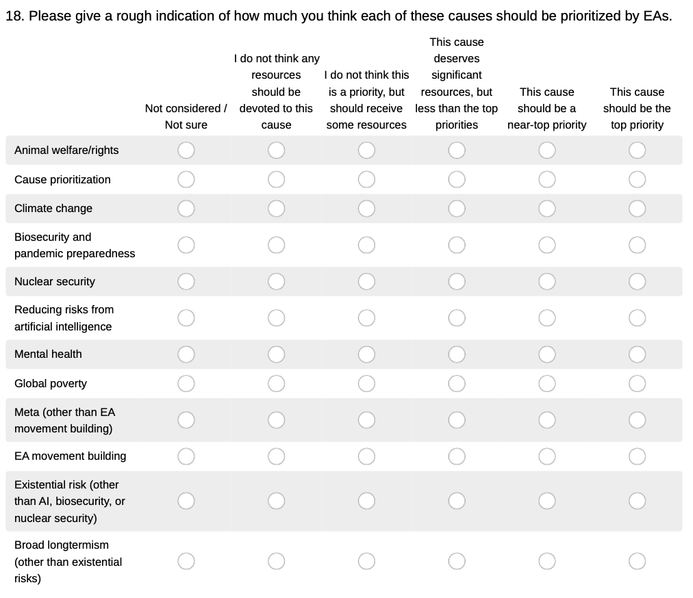
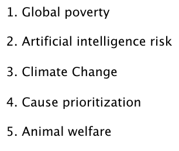
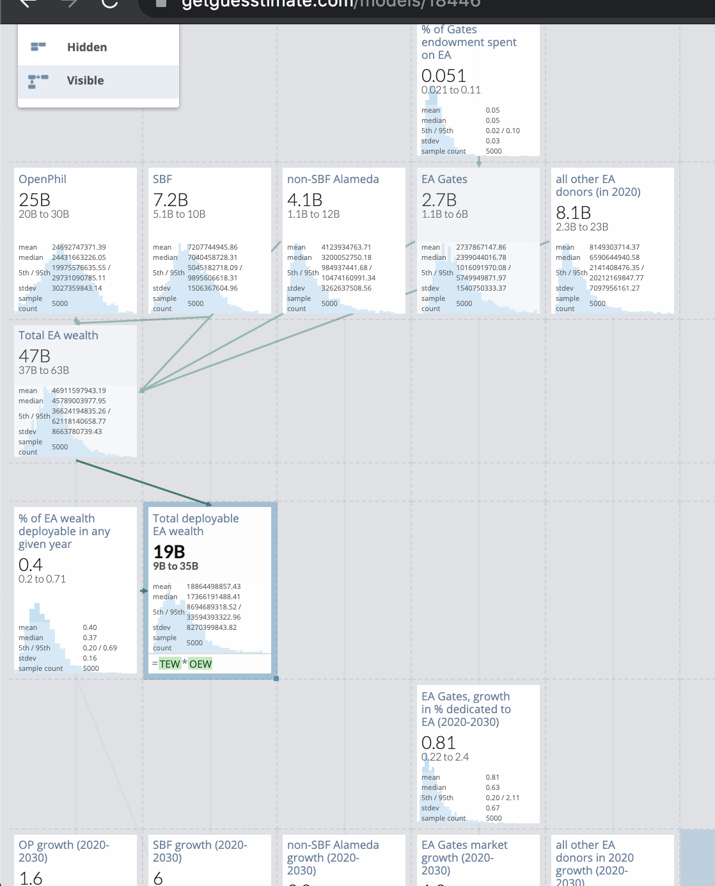
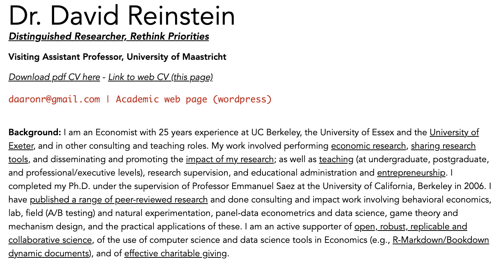
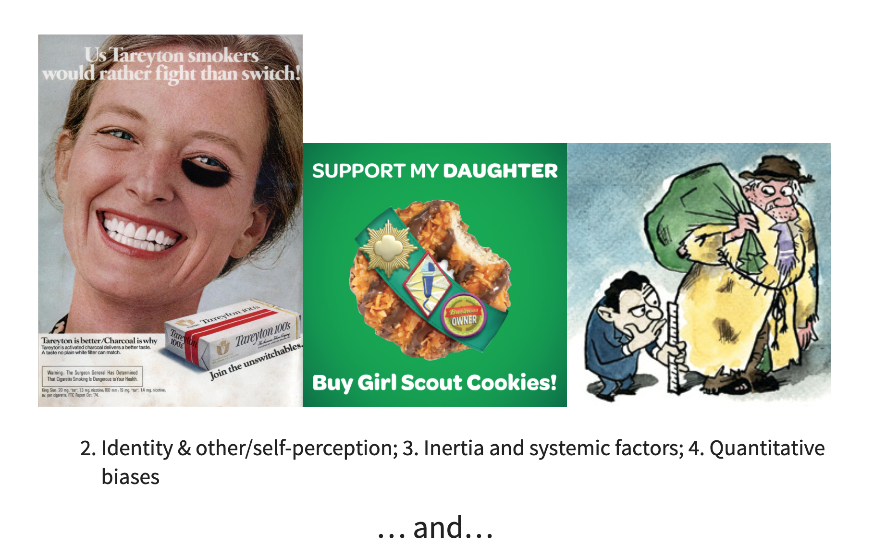
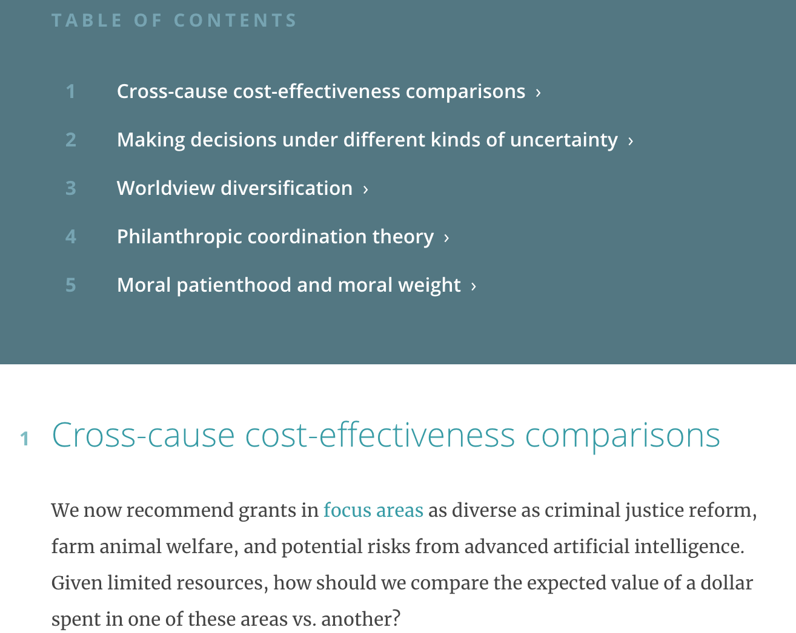
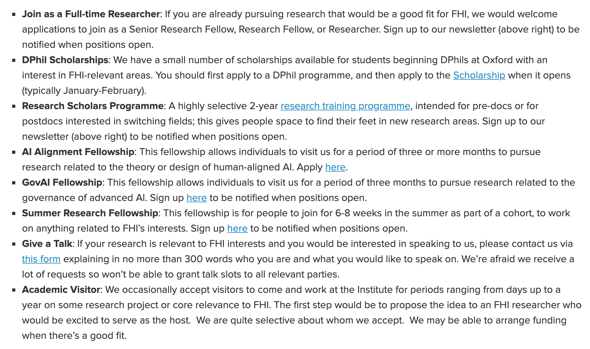

```{css, echo=FALSE}
.level1 {
  min-height: 300px;
  border: none;
  margin-bottom: 3em;
  padding: 1em 2em 2em;
  opacity: .5;
}
.is-active {
  opacity: 1;
  background-color: lightyellow;
}
body {
  margin-bottom: 80vh;
}

```

```{r, echo=FALSE, warning=FALSE}

# 'main_2020.R': this single file should (ideally) source and build all data, build codebooks, run all analysis, and build bookdown and other output

# In Rstudio, select 'Code - Run Region - Run all'

#### Setup ####

try_download <- function(url, path) {
  new_path <- gsub("[.]", "X.", path)
  tryCatch({
    download.file(url = url,
                  destfile = new_path)
  }, error = function(e) {
    print("You are not online, so we can't download")
  })
  tryCatch(
    file.rename(new_path, path)
  )
}


library(here)
here <- here::here()
rename_all <- dplyr::rename_all


#... Import packages for this project using template from dr-rstuff  ####
# - you don't need to do this each time, but it keeps it updated
try_download(
  "https://raw.githubusercontent.com/daaronr/dr-rstuff/master/functions/project_setup.R",
  here::here("code", "project_setup.R")
)

## You MUST run this for anything else to work (installs/loads key packages and functions):
source(here::here("code", "project_setup.R"))

#... and a few more packages ####
p_load_gh("peterhurford/funtools")
p_load_gh("remotes")
p_load_gh("tidymodels/corrr")


if (!require("devtools")) { install.packages("devtools") }
p_load_gh("peterhurford/checkr")

p_load_gh("peterhurford/currencyr")

p_load("binom")
p_load("readstata13")

#p_load("santoku")
#p_load("bettertrace")
#p_load("ggstatsplot")
#p_load("ggpubr")
#p_load(likert, pubh, ggtext)
#p_load_gh('peterhurford/surveytools2')
#p_load("arm")

#options(error = searcher("stackoverflow"))


#### Build and clean all data from 2020 ####

##Import relevant dataframes and set filters ####


  ## ...Import pre-2020 data, try to harmonise ####
  #needs running, as it's used (a bit) below
eas_all_private <- readRDS("/Users/yosemite/githubs/ea-data/data/edited_data/eas_all_private.Rdata", refhook = NULL)

eas_20 <- readRDS("/Users/yosemite/githubs/ea-data/data/edited_data/eas_20.Rdata", refhook = NULL)

```

# Preamble
## Message


The founders of Effective Altruism took ideas from Philosophy, Economics, and other parts of academia to build a rigorous approach to 'doing the most good in the world', and to exploring and measuring this.

Miraculously, EA also has a passionate and influential group of supporters, and a substantial pool of funds for research, interventions, and advocacy!

EA and global priorities research offers a huge opportunity for academic researchers to have an positive impact (on the allocation of funds, and on the market of ideas).

There are opportunities for funding to support your research within academia, to promote the impact of your research (and gain valuable feedback), to help students find meaningful careers/research\
...and/or you may want to leave academia work directly for an EA-aligned organization (like I did).

## Introduction: Effective Altruism

## 'What is Effective Altruism?



Doing the 'most good' given limited resources (some relationship to utilitarianism)... *but how do we define 'the most good'?*

---

---





---

2020 EA survey: all responses

```{r, echo=FALSE}
axes <-   theme(axis.text.x = element_text(angle = 90, vjust = 0.5, hjust=1),
                            panel.grid.major = element_line(colour = "gray"))


lik_priority_eas20 <- eas_20 %>%
    dplyr::select(
      starts_with("prioritize", ignore.case = FALSE), engagement_num,
      -prioritize_other
    ) %>%
    rename(
      "AI risk"=prioritize_ai_risks,
      "Animal welfare"=prioritize_animal_welfare,
      "Biosecurity and pandemic preparedness"=prioritize_biosecurity,
      "Broad longtermism"=prioritize_broad_longtermism,
      "Cause prioritization"=prioritize_causes,
      "Climate change"=prioritize_climate_change,
      "EA movement building"=prioritize_ea_movement,
      "Global poverty"=prioritize_global_poverty,
      "Mental health"=prioritize_mental_health,
      "Meta (Other than EA movement building)"=prioritize_meta,
      "Nuclear security"=prioritize_nuclear_security,
      "Existential risks"=prioritize_x_risks
    )

title <- "Cause Prioritization EA Survey 2020"

```

```{r, fig.cap=c('All responses'), fig.dim=c(8, 4)}


(
priority_ordered_bar <- lik_priority_eas20 %>%
      as.data.frame() %>%
    select(-engagement_num) %>%
    likert() %>%
  plot(.,
     type="bar") +
  ggtitle(title)
)


```

---

... 'Highly engaged' (self-rated)

```{r, fig.cap=c('Highly engaged only (rated 5/5)'), fig.dim=c(8, 4)}

(
priority_ordered_bar_eng <- lik_priority_eas20 %>%
  filter(engagement_num==5) %>%
        select(-engagement_num) %>%
   as.data.frame() %>%
    likert() %>%
  plot(type="bar") +
  ggtitle(title)
)
```

---

 *How much effective altruism/global priorities research funding is there?*

---

```{r, echo=FALSE}

library(scales)

research_terms <- "research|univ|study|UC|trial|scholar|fellow|macreoeconomic|rethink|study|feasibility|analysis|evaluation"

focus_area_names <- c(
`Criminal Justice Reform` = "Crime/Justice",
`Farm Animal Welfare` = "Farm Animal",
`Global Health & Development` = "Glob. Health/Dev.",
`Scientific Research` = "Scient. Res.",
`Potential Risks from Advanced Artificial Intelligence` = "AI risk",
`Biosecurity and Pandemic Preparedness` = "Biosec.",
`Other areas` = "Other",
`Macroeconomic Stabilization Policy` = "Macro-econ",
`Global Catastrophic Risks` = "Glob. Catastr.",
`Immigration Policy` = "Immig. Pol.",
`Land Use Reform` = "Land Ref.",
`U.S. Policy` = "US pol.",
`History of Philanthropy` = "Hist. of Phil."
  )


open_phil_grants <- read.csv("https://www.openphilanthropy.org/giving/grants/spreadsheet") %>%
  as_tibble() %>%
  mutate(
    amount = as.numeric(gsub('[$,]', '', Amount)),
    amount_usd_k = amount/1000,
    date = lubridate::my(Date),
    year = lubridate::year(date),
    focus_area = dplyr::recode(Focus.Area, !!!focus_area_names),
    focus_area = as.factor(focus_area),
    possible_research = case_when(
    grepl(research_terms, Grant, ignore.case = TRUE) ~ TRUE,
    grepl(research_terms, Organization.Name, ignore.case = TRUE) ~ TRUE,
    grepl("History|Research|Intel", focus_area,  ignore.case = TRUE) ~ TRUE,
    TRUE ~ FALSE
  )
  )  %>%
  select(-Amount, -Date)

```

```{r}


.kable_styling <- hijack(kableExtra::kable_styling, full_width=FALSE)
.kable <- hijack(knitr::kable, format.args = list(big.mark = ",", scientific = FALSE))


(
op_research_grants_tab <-
open_phil_grants %>%
  filter(possible_research==TRUE) %>%
  group_by(year) %>%
  dplyr::summarise(total =  format(sum(amount, na.rm = TRUE), big.mark=",", scientific=FALSE), grants = n()) %>%
  arrange(-year) %>%
    mutate(year=as.character(year)) %>%
    .kable(caption = "Open Phil (likely) research funding by year")  %>%
 .kable_styling()
)

```

---

By year and focus area:

```{r}

(
  op_res_grants_tab_yr_area <-
open_phil_grants %>%
    filter(possible_research==TRUE) %>%
    dplyr::group_by(year, focus_area) %>% # drop_na(!!yvar, !!treatvar) %>%
    summarise(total = sum(amount_usd_k,  na.rm = TRUE)) %>%
    spread(year, total, fill=0) %>%
    arrange(-`2020`) %>%
    .kable(caption = "OpenPhil (likely research) grants by year and area, in $1000 USD") %>%
    .kable_styling()
)

(
  op_res_grants_line <-
open_phil_grants %>%
  group_by(year, focus_area) %>%
    mutate(total = sum(amount_usd_k, na.rm = TRUE)) %>%
    ggplot() +
    aes(x = year, y = amount_usd_k, colour = focus_area) +
    geom_jitter(width = 0.5, height = 0.2, size=0.8) +
  scale_colour_discrete(labels = function(x) str_wrap(x, width = 15)) +
    geom_line(aes(x=year, y=total)) +
  ylab("Grant amounts in $1k")
)

(
open_phil_grants %>%
  filter(possible_research==TRUE) %>%
  filter(year==2020) %>%
  group_by(Focus.Area) %>%
  summarise(total = format(sum(amount, na.rm = TRUE), big.mark=",", scientific=FALSE), grants = n()) %>%
  dplyr::arrange(-grants) %>%
  .kable(caption = "Open Phil (likely) research funding, 2020") %>%
  .kable_styling()
)

```

---

By organization

```{r}

(
  op_res_grants_tab_orgs_area <-
open_phil_grants %>%
    filter(possible_research==TRUE) %>%
    dplyr::group_by(Organization.Name) %>% # drop_na(!!yvar, !!treatvar) %>%
  summarise(total = sum(amount_usd_k,  na.rm = TRUE), `number of grants` = n()) %>%
      arrange(-total) %>%
    filter(total>5000) %>%
    .kable(caption = "OpenPhil (likely research) grants by corganization  and area, in $1000 USD") %>%
  .kable_styling()
)

```

## Other organizations funding or doing EA/GP research, or likely interested

```{r}

knitr::include_url("https://www.longview.org/grantmaking",  height = "800px")
```

---



Maybe 500 million USD per year in EA/adjacent donations (+ about 250 million from OpenPhil)

-   GiveWell moving \~\$80M per year

-   Founders Pledge

-   Longview

-   Effective Giving

-   EA Funds

-   "Gates Foundation seems to do \~\$100M-500M/yr of grants in global economic development that seem to have cost-effectiveness on par with GiveWell work"

It's not all research funding, but some of it is, and it is all *interested* in prioritization/effectiveness research.

```{=html}
<!-- There is a large amount of
Lots from tech and crypto billionaires/millionaires. Some 'bigger fish' on the line too like Elon Musk -->
```
#

```{r}

knitr::include_url("https://eaforum.issarice.com/posts/f6kg8T2Lp6rDqxWwG/list-of-ea-related-organisations", height = "800px")
```

Research orgs (partial list):

-   Future of Humanity Institute (about 70 including affiliates, fellows, affiliates)
-   Global Priorities Institute (about 20 researchers/affiliates)
-   Rethink Priorities (11 researchers, hiring more)
-   GiveWell (about 10 researchers/advisors)
-   Animal Charity Evaluators (5-ish)
-   Machine Intelligence Research Institute (about 20)

---

How do most 'effective altruists' engage; what is most strongly advocated?


```{=html}
<!-- 1.  Political action

2.  Effective charitable donations/Earning to give

3.  Pursuing a high-impact career

4.  Avoiding environmental damage through personal actions
-->
```
---


EAs are moving towards pursuing impact through their careers.

Since 2015 ["80,000 Hours thinks that only a small proportion of people should earn to give long term"](https://80000hours.org/2015/07/80000-hours-thinks-that-only-a-small-proportion-of-people-should-earn-to-give-long-term/) (MacAskill)

There is also some support for politial influence, at least they say "the hour you spend voting is likely to be the most impactful one in your entire year on average... ...influence over how hundreds of thousands or millions of dollars are spent."

---


[Source - EA survey 2020 forum post](https://forum.effectivealtruism.org/posts/ThdR8FzcfA8wckTJi/ea-survey-2020-demographics#Level_of_Engagement)

# My story



Telling you my story because it might help you understand the strengths and limitations of academia and working at an EA org, and whether this aligns with your interests.

From my [web CV](https://daaronr.github.io/markdown-cv/) ...

---

```{r, echo=FALSE}

knitr::include_url("https://daaronr.github.io/markdown-cv/", height = "800px")
```

---


Berkeley:

-   Proposing 'new ideas' like the [Poor Card](https://theconversation.com/should-we-help-companies-tailor-prices-to-your-wage-packet-47719)

Limited audience: 'How does this inform *government* policy?', 'How does it inform/relate to standard Economics (tractable mathematical) models of optimization?', 'Will this publish well'?

---

   Considering ideas with a pre-EA policy audience.

-   'Does one donation come at the expense of another'?

-   Should an 'efficient altruist' purchase 'fair trade' products, bundling consumer choices with additional revenue to poor farmers/workers?\

---

Things I care about: lining up with concepts in the discipline? But I really cared about ideas and impact.

 Essex, UK:

-   Experiments/trials and observational work on charitable and gift-giving: social influences, types of income/uncertainty

-   Applied microeconomic theory

---


Moved to Exeter, UK

-   to pursue 'Impact' (ESRC grant, REF focus)

-   Building teaching/research/outreach resources, such as

    -   [innovationsinfundraising.org](innovationsinfundraising.org) and ['barriers to effective giving'](https://daaronr.github.io/ea_giving_barriers/index.html)
    -   "Researching and writing for Economics students"

---

 Positives: A fairly supportive environment, research freedom, many great colleagues, moderate teaching, targets 'deep and rigorous theoretical work', some of the smartest people

Limitations: academic politics and poor upper-management, countervailing rewards system, constant discussion of points/games (value drift), students

Standard publications as the only way to prove value; limits collaborative and nonstandard work

UK academia rewards either 'REF-points publications', box-ticking accreditations, or currying favor with 'admin'

---


In 2021 I left my secure academic post:

> To pursue greater impact as a researcher at [Rethink Priorities](https://www.rethinkpriorities.org/our-team), a think tank "dedicated to figuring out the best ways to make the world a better place." RP is closely tied to the Effective Altruism movement. My research into effective charitable giving is made possible by a grant from an individual donor under the advising of Longview Philanthropy.

> To build tools and programs promoting open, collaborative, and robust research, as well as teaching, learning, and research training outside of traditional university degree schemes.

(Should you do it too? Back to this at the end)

---

0.  Longview-funded: ['Barriers to effective giving'](https://daaronr.github.io/ea_giving_barriers/index.html)

-   Categorization and links to Economics and Psychology 'theory'

-   Meta-analysis and synthesis

-   Field experiments and trials in large-scale contexts

1.  [EA Survey and 'movement building'](https://rethinkpriorities.github.io/ea_data_public/demog.html)

-   Survey methods: representativeness, survey design

-   Identifying key questions for 'tracking a movement and its impact', e.g.,

    -   "Which people are likely to contribute the most; 'selecting' where to promote'" (ML and inference)
    -   "What will the impact of the EA community be in 10-20 years?" (APC modeling)
    -   Do anticipated donations tend to exceed actual donations and when/why

-   Analysis: Visualisation, descriptive, predictive, and

2.  Outreach and message testing

-   Receptiveness to parts of EA message

-   Support for policies (e.g., animal welfare)

3.  Future work: moral weights, measurement of satisfaction, 'near-term' (global health) evaluation, 'shallow reviews'

4.  Support and guidance to other RP projects (e.g., modeling the meat industry; designing behaioural trials)

5.  Connection with academia; publishing, recruiting, advising students

# Effective altruism and global priorities

```{r, echo=FALSE}

knitr::include_url("https://slatestarcodex.com/blog_images/ea_imagemap8.html", height = "800px")

```

## What are the 'important cause areas'?

Near term, Long-term future, Animal welfare, Prioritization research and ethics


---

-   Global health, environmental
-   Extreme poverty
-   Mental health
-   Manmade/political suffering
-   Global warming

---


---

-   Existential risk
-   'S-risk' (suffering)
-   Population growth/expansion

Global catastrophic risks: Artificial Intelligence 'alignment', Bio risks and epidemics, Nuclear/political

---


---

-   Factory farming and fishing
-   Wild animal welfare

---

{width="719"}

E.g.,

-   How to create better systems for creating and disseminating knowledge
-   Whether and how to 'discount' future individuals (income or happiness)?
-   How to make choices under moral uncertainty
-   How to value 'more happy people' versus 'happier people' (population ethics)

```{r, echo=FALSE}

knitr::include_url("https://globalprioritiesinstitute.org/research-agenda-web-version/", height = "800px")
```

# EA perspectives: Why do we need research, what should research do?

1.  Defining a moral, value and choice framework, working out thorny moral decision-optimization issues

2.  Empirical measurement of value and 'what works to achieve it'

3.  Empirical evidence on persuasion: 'how to get people to act pro-socially and effectively'

---

**Defining a moral framework, considering 'what has value', and 'how to learn and choose'?**

... how to value things and be consistent, how to use uncertainty and information in making altruistic choices

E.g.,

-   moral weights

-   population ethics

-   moral uncertainty .

---

From GPI agenda:

> Under what conditions would a social planner or philanthropist prioritise policies that primarily increase social welfare in the far future rather than in the near term? For instance, under what condition would such agents prioritise saving for future generations (Ramsey 1928) or reducing the risk of human extinction (Baranzini and Bourguignon 1995)?

> Should one have the same levels of epistemic modesty about unusual moral views as one should about unusual empirical views?

> To what extent should we be risk averse in our approach to doing good, and what are the implications of reasonable risk aversion for global prioritisation? (Quiggin 1982; Buchak 2013; Greaves et al. MS)

> Social welfare criteria that are used to compare states that differ in population size typically specify a critical welfare level at which lives that are added to the population have zero contributive value to social welfare (Blackorby et al. 1995; Ng 1986; Broome 2004; Ch. 10). What kinds of lives have zero contributive value in this sense (Cockburn et al. 2014; Cowie 2017)?

---

**Empirical measurement informing the 'production function for good'**

-   'What has value and moral worth?' (e.g., sentience research)

-   How to measure value? (e.g., pain/pleasure DALY)

-   How to achieve value?
    - Direct interventions and policies, direct/indirect, short and LT impacts
    - Very long term impacts, inference with deep uncertainties

> Should we loosen migration restrictions to increase global welfare? What is a politically feasible level of migration? (from [Rhys-Bernard syllabus](https://docs.google.com/document/d/1A-AJLTbukninH_enX0Ex_w-8S4dWj8TB4_-Qi1KGPvQ/edit#heading=h.u8xi93xmhjug))


> Estimating, in terms of SWB, the impact of potentially highly-effective interventions, including: psychotherapy for common mental disorders; cataract surgery for blindness; deworming tablets to improve lifelong earnings (from [Happier lives institute](https://www.happierlivesinstitute.org/research-agenda.html) research priorities)


<!--   Empirical:
    -   Measurement of 'pain and pleasure' informing moral worth and how to measure the success of interventions
    -   Interventions -- which ones work, how effective are they
    -   Very hard ones -- predicting long term and areas of deep uncertainty
-->

---

[](https://daaronr.github.io/dualprocess/GPI_barriers_evidence_sc.html#/4/3)

**Empirical (behavioural) ... How to get people and institutions to care about others (altruism) and about being effective in doing so?**

-   Barriers to considering effectiveness and acting effectively (my focus -- open project [HERE](https://daaronr.github.io/ea_giving_barriers/index.html))

-   Applied work : message testing, information and choice-architecture


## Open Philanthropy: "Technical and Philosophical Questions That Might Affect Our Grantmaking"


[](https://www.openphilanthropy.org/blog/technical-and-philosophical-questions-might-affect-our-grantmaking#top)


See also: this [list of lists(https://forum.effectivealtruism.org/posts/MsNpJBzv5YhdfNHc9/a-central-directory-for-open-research-questions)]


# Operationalizing: 'Which research to prioritize'?

'How to measure research impact?


# How research in EA differs from research in academia (motivations, how success is measured)


```{r, echo=FALSE}

knitr::include_url("https://www.getguesstimate.com/models/17702", height = "800px")
```


Academia:

- Publications, grants, citations, students placed in jobs, awards

- You need to be the 'first to publish' on a new topic; supporting evidence less valued

RP:

- Impact on funds allocated and 'influence' on decisionmakers
- Publications and grants as a means to an end; discussion of how much to publish traditionally versus other outlets

> model estimates impact by considering the probability of our influence targets updating in the correct direction ... the amount of money and resources that are changed, how much better (or worse) that change is, the counterfactual years of credit due to the work, and the costs of the project.


----

```{r, echo=FALSE}

knitr::include_url("https://www.getguesstimate.com/models/17702", height = "800px")
```

Money-metric impact of a random-ish sample of projects:

'Multiplying the uncertain estimates of' (Bayesian):

- Probability our research changes the "influence-target's" choice $\times$
- probability this is in the right direction $\times$
- Funds affected $\times$
- Proportional increase in the funds' impact $\times$
- "Counterfactual years impacted"


Divide by project cost

$\rightarrow$  "Impact per dollar spent"

$\rightarrow$ Extrapolate to total value of RP


## Changing the game: Ideas for more productive system of peer feedback and credibility

The EA research landscape - a new 'funder' and consumer of research

We care about research value, accuracy, and impact, not as mch  'innovation' or theoretical rigor

We are not so tied to traditional institutions (publishers, traditional grantmakers)


$\rightarrow$ ['Evaluated project repo'](https://docs.google.com/document/d/1GFISlF5TieCuA6jDYkYlNWaEpuEYrr_zTmaVpTfBg4A/edit#heading=h.iqq0k5uqyg8x) rather than frozen publications?

## *Can we help academia escape the journal publication collective-action problem?*


# How you can get involved; opportunities

[](https://www.fhi.ox.ac.uk/vacancies/)

[Rethink Priorities is hiring](https://www.rethinkpriorities.org/jobs) -- "Staff Researcher (Global Health and Development)", several positions, and very soon "a longtermist and a meta/movement building person"

- [GPI/Forethought fellowship](https://www.forethought.org/fellowship-2021-apply-now), [pre-doctoral](https://globalprioritiesinstitute.org/wp-content/uploads/GPI-Predoctoral-Research-Fellow-Economics.pdf


- [EA Funds grants](https://funds.effectivealtruism.org/apply-for-funding), e.g,, for "Promising research into animal advocacy or animal well-being"


- Action: [Charity Entrepreneurship incubator](https://www.charityentrepreneurship.com/)

- [Open Philanthropy grants](https://www.openphilanthropy.org/giving/guide-for-grant-seekers): ramping up, very interested in funding research but "In general, we expect to identify most giving opportunities via proactive searching and networking"

## How can academics support and do EA/GP research within universities

-   Contact EA organisations; present your work

-   Help build open-content

Encourage your students

- to apply for GPI/FHI/RP fellowships and internships
- to engage with the [Effective Thesis Project](https://effectivethesis.org/project/)


### Who should want to work at an EA org? Why or why not?

Note: RP and GPI differ dramatically in focus and approach; I'm mainly talking about RP.

YES if you (because you like)...

-  Care about impact and social good; research outcomes, implications, applications

-  Rigorous analytical framework (Philosophy, Economics, Statistics/data) *anchored and connected to the practical*

-  "Interdisciplinary" in the right way

-  Positive, supportive environment: people motivated by *outcomes*, zero competitiveness/politics AFAIK

-  High-achieving, super-literate and 'switched on' colleagues

\

NO if you want to...

- Focus on deeply theoretical 'pure' research without a direct connection to impact

- Earn a lot of money, have the long-term job security of 'tenure'

\

MAYBE  if you want to...

- Teach/work with a large group of motivated young people, guide careers

- Publish in academic journals and the equivalent, present at academic conferences

- Prestige/public intellectual


## Which fields?

Economics: Both theory and empirical/application, development economics, behavioral, preference and choice theory, macrroeconomics, and more

Philosophy: The answers to 'arcane' philosophical questions are now driving  very important decisions and uses of funds

Psychology and behavioral science: "How to get people to care", "how to do messaging and how to measure the results"

Maths, statistics, computer science: AI-risk, data science, mathematics of uncertainty and forecasting, controlling technology, statistical experimental design...

Political science and international relations/area studies

Biology and neuroscience (RP just hired an entymologist): Wild animal welfare, animal sentience

Other sciences: Existential risks (natural and human)


EA impact success funding -- <https://www.getguesstimate.com/models/17702>

Marcus description for openphil that talks about 'how we think about this'

How to promote this

-   EA is trying to be empirically motivated

-   There is a lot of money your research can move

-   There is money to get the research done (e.g., FHI, Open Phil, CEA)

Other grants -- the swiss group 'negative utilitarians'; center for LT risk -- lots of funding not going through AI, Longview, Effective Giving, Founders Pledge

Openphil science budget is multi-million -- 50-60 million dollars per year, not including 40 million on AI


If you are working in animal science, development econ, public health, psychology -- giving and messaging

Human welfare: huge survey qaly and daly; neutral point on subjective well-being; Open Phil and others are willing to take the information and update it
